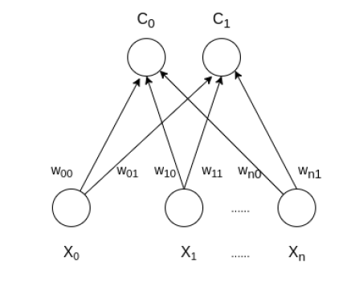
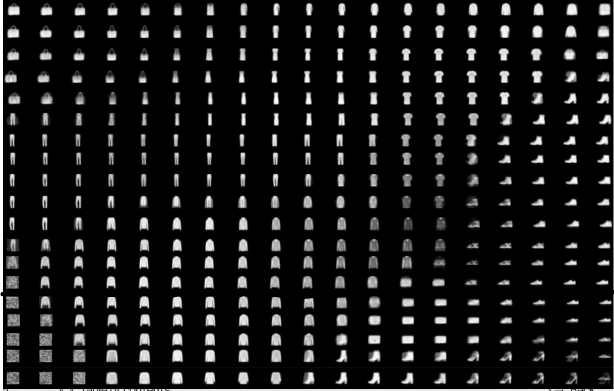

## Kohonen Algorithm
This Project aims to cluster Fashion Mnist train data to a specified nodes using **Self Organizing map** algorithm 
#### :rocket: Description
:fire: SOM is a type of Artificial Neural Network which is also inspired by biological models of neural systems from the 1970s. It follows an unsupervised learning approach and trained its network through a competitive learning algorithm. SOM is used for clustering and mapping (or dimensionality reduction) techniques to map multidimensional data onto lower-dimensional which allows people to reduce complex problems for easy interpretation. SOM has two layers, one is the Input layer and the other one is the Output layer. The architecture of the Self Organizing Map with two clusters and n input features of any sample is given below: 

 #### :calendar: Let’s say an input data of size (m, n) where m is the number of training examples and n is the number of features in each example. First, it initializes the weights of size (n, C) where C is the number of clusters. Then iterating over the input data, for each training example, it updates the winning vector (weight vector with the shortest distance (e.g Euclidean distance) from training example). Weight updation rule is given by : 
$w{ij} = w_{ij}(old) + alpha(t) *  (x_{i}^{k} - w_{ij}(old))$

⚡ where alpha is a learning rate at time t, j denotes the winning vector, i denotes the ith feature of training example and k denotes the kth training example from the input data. After training the SOM network, trained weights are used for clustering new examples. A new example falls in the cluster of winning vectors. 
### Results 

